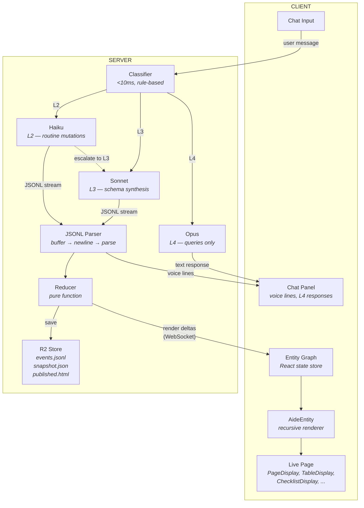

# AIde v2: Overview

> **Read time:** 5 minutes
> **Audience:** Everyone on the team
> **Next:** Pick the doc for your area → [Data Model](01_data_model.md) · [JSONL Schema](02_jsonl_schema.md) · [Streaming Pipeline](03_streaming_pipeline.md) · [Display Components](04_display_components.md) · [Intelligence Tiers](05_intelligence_tiers.md)

---

## What Is AIde

An aide is a living object. The user describes what they're coordinating — a graduation party, a poker league, a group trip — and AIde brings it to life as a shareable page that stays current through natural language conversation. The page is the object's body. The chat is how you talk to it. No account needed to view.

The tagline: **For what you're living.**

### Why Not Just a Chat?

General-purpose AI chat (Claude, ChatGPT) drifts. By turn 20, the model has forgotten what you said at turn 3. You repeat yourself. You paste context back in. The conversation becomes the coordination tool — but conversations are terrible at maintaining state.

AIde solves this by scoping the LLM's job. The entity graph is the memory, not the conversation. When the user says "Aunt Linda RSVPed yes," the LLM doesn't need to remember 30 turns of context — it reads the current entity graph, compiles the message into a mutation, and moves on. The conversation tail is 3-5 messages for intent disambiguation, not a growing liability.

This scoping also makes the LLM more reliable. A general chat model juggling "write me a poem, also what's the weather, also update my guest list" makes mistakes. An AIde LLM has one job: maintain this entity graph. The system prompt is short and specific. The output format is constrained (JSONL). The reducer validates every operation. The attack surface for hallucination is small.

The page is the artifact, not the chat. The chat is the input method.

---

## Why v2

v1 is too slow. Creating a new aide takes ~10 seconds. For our target user — a parent coordinating a graduation party for 40 guests — that's a closed tab. They go back to the group text.

**Speed is the product.** The page must start appearing within one second.

---

## The Five Changes

### 1. Entities All the Way Down → [01_data_model.md](01_data_model.md)

v1 had three parallel structures: collections, blocks, and views. The LLM generates all three.

v2 has one: an **entity tree**. An entity can contain other entities. What was a "collection" is an entity with children. What was a "block" is an entity with a display hint. One structure → fewer tokens → faster.

```
grad_page (display: "page")
├── ceremony (display: "card")
├── guests (display: "table")
│   ├── aunt_linda
│   └── uncle_steve
├── food (display: "table")
└── todos (display: "checklist")
```

Cross-branch connections (Linda is *bringing* the potato salad) are modeled as **relationships** — typed links between any two entities in the tree.

### 2. LLM Emits Only Primitives → [02_jsonl_schema.md](02_jsonl_schema.md)

**The rule:** The LLM never generates what the renderer can derive.

v1: LLM produces primitives + HTML + voice reflections + explanations. ~3-5K tokens.
v2: LLM produces only entity operations as JSON. ~600-1500 tokens. The deterministic renderer produces all HTML.

### 3. JSONL Streaming → [03_streaming_pipeline.md](03_streaming_pipeline.md)

The LLM emits one JSON line per operation. The server parses each line on arrival, reduces it, and pushes a render delta to the client via WebSocket. The page builds itself in real time.

The LLM emits in **render order** — page title first, sections next, items last. The user sees the page scaffold top-down.

### 4. React Compiler → [04_display_components.md](04_display_components.md)

A recursive React component walks the entity tree. Each entity maps to a display component based on its `display` hint: `table` → TableDisplay, `checklist` → ChecklistDisplay, etc.

~9 components, ~385 lines total. Every rendered value is **directly editable** — click to change, no LLM round trip. Under 200ms.

### 5. Three-Tier Intelligence → [05_intelligence_tiers.md](05_intelligence_tiers.md)

| Tier | Model | Job | Latency |
|------|-------|-----|---------|
| L2 | Haiku | Routine mutations ("add Aunt Linda") | <1.5s |
| L3 | Sonnet | Schema synthesis ("plan my graduation party") | <4s |
| L4 | Opus | Queries ("who hasn't RSVPed?") | <5s |

85% of interactions hit Haiku. Queries use Opus because wrong answers erode trust.

---

## Two Speeds

AIde has two interaction speeds. Both always available.

**AI speed (1-5s):** Talk to the LLM. Create structure, add guests, ask questions.

**Spreadsheet speed (<200ms):** Click a value and edit it. Toggle a checkbox. Drag to reorder. Undo. No LLM involved.

The fast loop makes the slow loop trustworthy. If the user can fix any mistake instantly, they'll tolerate the AI being occasionally wrong.

→ Details in [Edge Cases & Reliability](07_edge_cases.md)

---

## Target Performance

| Interaction | v1 | v2 Target |
|-------------|-----|-----------|
| First creation | ~10s, nothing visible until done | <1s first content, <4s complete |
| Routine update | ~3s | <1.5s |
| Direct field edit | n/a (requires AI) | <200ms |
| Query | ~3s, often wrong | <5s, reliable (Opus) |

---

## Capability Boundaries

**Native:** Entity graph mutations, short text (one paragraph max), queries over state.

**Skills (v2):** Calendar invites, CSV export, reminder drafts. Not at launch.

**Redirects:** "Write a graduation speech" → suggests Claude or Google Docs. "Generate an invitation graphic" → suggests Canva. Tells the user how to bring the result back.

→ Details in [Capability Boundaries](08_capability_boundaries.md)

---

## Architecture Diagram

→ See rendered diagram: [aide_v2_architecture.mermaid](aide_v2_architecture.mermaid)



**The data flow:**
1. User message → Classifier picks tier (L2, L3, or L4)
2. L2/L3 → JSONL stream → Parser → Reducer → render deltas → client entity graph
3. L4 → text response → client chat panel (no JSONL, no parser, no reducer)
4. Voice lines extracted from JSONL stream → client chat panel
5. L2 escalation to L3 re-enters the JSONL path (not the L4 path)

**What's in R2:**
- `{aide_id}/events.jsonl` — append-only event log (source of truth)
- `{aide_id}/snapshot.json` — materialized entity graph (rebuilt each mutation)
- `{aide_id}/published.html` — static server-rendered page for public URL

HTML rendering is client-side during editing (React). At publish time, the server renders the same components to static HTML. Visitors see plain HTML — no React, no WebSocket, no account needed.

---

## Doc Map

| Doc | What It Covers | Read If You... |
|-----|---------------|----------------|
| **[00 Overview](00_overview.md)** | This doc. The big picture. | Are new to the project |
| **[01 Data Model](01_data_model.md)** | Entity tree, relationships, schema inference | Touch state or the reducer |
| **[02 JSONL Schema](02_jsonl_schema.md)** | All 13 primitives + 4 signals, event wrapping | Touch the LLM pipeline or server |
| **[03 Streaming Pipeline](03_streaming_pipeline.md)** | Server parsing, WebSocket, caching, streaming rules | Touch server or client integration |
| **[04 Display Components](04_display_components.md)** | React compiler, all 9 components, EditableField | Touch the frontend |
| **[05 Intelligence Tiers](05_intelligence_tiers.md)** | L2/L3/L4, routing, escalation, multi-intent, costs | Touch LLM orchestration |
| **[06 Prompts](06_prompts.md)** | System prompts for L2, L3, L4 | Touch LLM behavior |
| **[07 Edge Cases](07_edge_cases.md)** | Interrupt, undo, retry, errors, speed budget | Touch reliability or UX |
| **[08 Capability Boundaries](08_capability_boundaries.md)** | Native/skills/redirects, scoping rules | Touch product scope |
